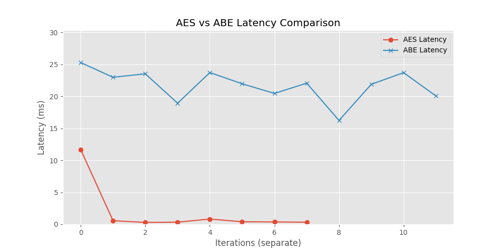

# AES vs ABE Latency Comparison

This project compares the performance of:

- AES (Advanced Encryption Standard)
- ABE (Attribute-Based Encryption)

## 📊 Overview
The goal is to measure and visualize the latency difference between AES and ABE encryption techniques.

## ⚙️ Features
- Simulated AES encryption
- Simulated ABE encryption with policy-based access
- Latency measurement
- Graph visualization using matplotlib

## 📈 Results

- AES is significantly faster (low latency)
- ABE is slower but provides fine-grained access control

## 🗂 Project Structure
- main.py → main execution file
- encryption/ → AES & ABE logic
- acl/ → access control logic
- anomaly/ → anomaly detection

## ▶️ How to Run
```bash
python main.py
```