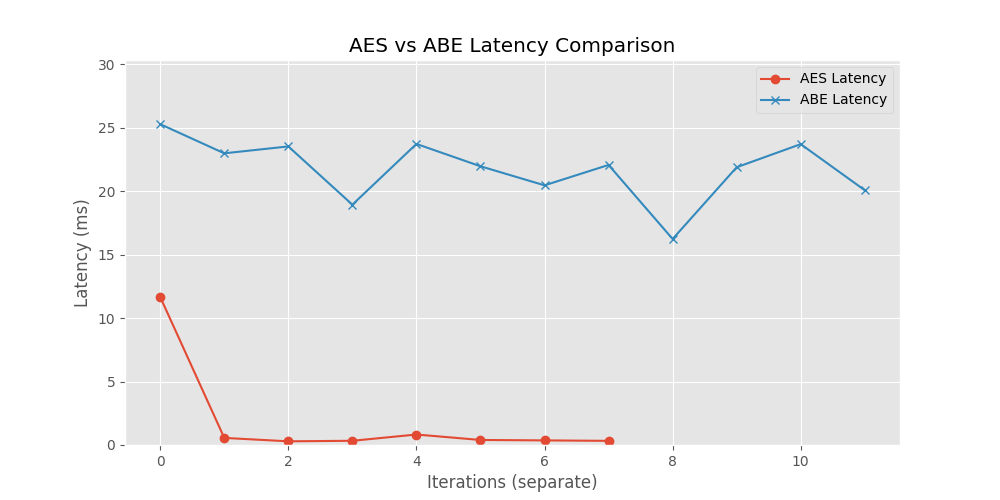

# RCS — Resilient Cloud Security Framework

A three-layer cloud security framework combining policy-based attribute encryption, hybrid access control (RBAC + ABAC), and machine learning–based anomaly detection — built and evaluated through a 500-request simulation.

## 📊 Overview

This project simulates a secure cloud data-access pipeline. Each simulated request passes through three security layers in sequence:

1. **Access Control** — Role-Based Access Control (RBAC) and Attribute-Based Access Control (ABAC) decide whether a request is allowed through at all.
2. **Encryption** — based on a computed data-sensitivity score, each request is protected with either AES-256-GCM (lower sensitivity) or a policy-based attribute encryption scheme (higher sensitivity).
3. **Anomaly Detection** — a Random Forest classifier scores each processed request's access pattern (entropy, rate, volume) to flag potentially anomalous behavior.

The simulation measures and reports latency, throughput, and ML model performance across all three layers.

## ⚙️ Features

- **RBAC + ABAC access control** — role permissions combined with environmental/contextual rules (e.g. location, time window)
- **Real AES-256-GCM encryption** for lower-sensitivity data
- **Policy-based attribute encryption** (CP-ABE-style) for higher-sensitivity data — see note below
- **Random Forest anomaly detection**, trained and evaluated with accuracy, precision, recall, F1-score, 5-fold cross-validation, and a confusion matrix
- **500-request simulation** with full metrics: throughput, per-layer latency (min/avg/max), access denial rate, and anomaly rate
- **Visualization**: latency comparison graphs and confusion matrix, saved as images

## 🔐 On the encryption scheme — what it is, honestly

The high-sensitivity encryption layer (`encryption/abe.py`) is **not** pairing-based CP-ABE in the strict academic sense (the original Bethencourt–Sahai–Waters scheme requires bilinear pairings over elliptic curves via libraries like `charm-crypto`, which are impractical to install on Windows/standard environments).

Instead, it implements a real, working alternative that achieves the same practical goal — fine-grained, policy-based access to encrypted data — using:

- **Shamir's Secret Sharing** to split an AES-256 key into shares tied to policy attributes
- **HKDF** to derive a unique cryptographic key per attribute, binding each share to its attribute
- **AES-256-GCM** for authenticated encryption of the actual data
- **Lagrange interpolation** to reconstruct the key only when enough correct attribute shares are supplied (supports k-of-n threshold policies, not just strict AND policies)

This is a legitimate, citable cryptographic technique (secret-sharing-based attribute encryption) and is fully real, tested encryption — not a placeholder. It is distinguished here from pairing-based CP-ABE for academic accuracy.

An earlier placeholder version (`encryption/abe_simulated.py`) used a hardcoded delay to simulate latency without performing real encryption; it is retained in the repo for reference but is no longer used by `main.py`.

## 📈 Results




**From a representative 500-request run:**

| Metric | Value |
|---|---|
| Requests processed | ~480 / 500 (rest denied by RBAC/ABAC) |
| AES latency (avg) | ~0.5 ms |
| ABE latency (avg) | ~0.9 ms |
| Throughput | ~60–75 requests/sec |
| Anomalies detected | ~50–60 (~11–12%) |

**ML model evaluation (Random Forest anomaly detector):**

| Metric | Value |
|---|---|
| Accuracy | ~97% |
| Precision | ~87.5% |
| Recall | ~87.5% |
| F1-score | ~87.5% |
| 5-fold CV mean accuracy | ~95.7% |

Real ABE-style encryption adds modest overhead over AES (roughly 1.5–2x), which is expected given the additional secret-splitting and key-derivation work — but the absolute overhead is sub-millisecond and practical for real deployment. This is a more honest result than the original placeholder, which used an artificial delay that made ABE appear 30–50x slower than AES.

## 🗂 Project Structure

\```
RCS_Project/
├── main.py                  # 500-request simulation entry point
├── app.py                   # Streamlit demo UI (note: currently uses the
│                             #   older simulated ABE module — see Known
│                             #   Limitations)
├── acl/
│   ├── rbac.py               # Role-Based Access Control
│   └── abac.py                # Attribute-Based Access Control (environment rules)
├── encryption/
│   ├── abe.py                 # Real policy-based attribute encryption (SSS + HKDF + AES-GCM)
│   ├── abe_simulated.py       # Legacy placeholder, kept for reference, unused by main.py
│   ├── aes_encrypt.py         # AES-256-GCM encryption
│   └── sensitivity.py         # Data sensitivity scoring
├── anomaly/
│   ├── train_rf.py            # Random Forest training + full evaluation report
│   └── detect.py              # Per-request anomaly scoring
├── results/
│   ├── comparison.png         # Latency comparison graph (generated by main.py)
│   └── confusion_matrix.png   # ML evaluation confusion matrix (generated by train_rf.py)
└── requirements.txt
\```

## ▶️ How to Run

Install dependencies:
\```bash
pip install -r requirements.txt
\```

Run the full 500-request simulation:
\```bash
python main.py
\```
This prints per-layer summary statistics to the console and saves a latency comparison graph to `results/comparison.png`.

Run the ML model evaluation separately:
\```bash
python anomaly/train_rf.py
\```
This prints accuracy, precision, recall, F1-score, and cross-validation results to the console, and saves a confusion matrix to `results/confusion_matrix.png`.

(Optional) Run the Streamlit demo:
\```bash
streamlit run app.py
\```

## ⚠️ Known Limitations

- `app.py` (the Streamlit demo) still imports the older `abe_simulated.py` placeholder and uses a separate, simpler rule-based anomaly check rather than the trained Random Forest model used in `main.py`. The two entry points are not yet fully unified.
- The attribute encryption scheme is secret-sharing-based, not pairing-based CP-ABE (see explanation above).
- The anomaly detection dataset is synthetically generated with a fixed labeling rule plus injected noise, rather than sourced from real-world cloud access logs.

## 🧰 Tech Stack

Python · scikit-learn (Random Forest) · pycryptodome (AES-GCM, HKDF) · pandas · matplotlib · Streamlit